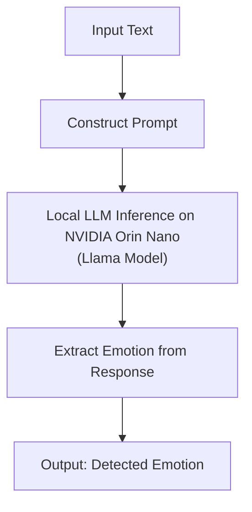

# Problem Statement
Inferring emotions from multiple modalities is very critical for social communication and deficits in emotion recognition are a very important marker in the diagnosis of autism spectrum disorder. This project uses Llama 3.1 and Jetson Nano orin kit to help autistic individuals recognize emotions in text.

## Demo of Text Emotion Detection


https://github.com/user-attachments/assets/31ad08cc-1139-42f7-a3ff-35fe702f0b14

## Architecture 



## Installation

1. **Clone the Repository:**

   ```bash
   git clone https://github.com/yourusername/text-emotion-detection.git
   cd text-emotion-detection

2.  Download the model, for instance
   for eaxmaple `Meta-Llama-3.1-8B-Instruct-Q4_K_M.gguf` form huggingface

## Usage 
```bash
streamlit run app.py
